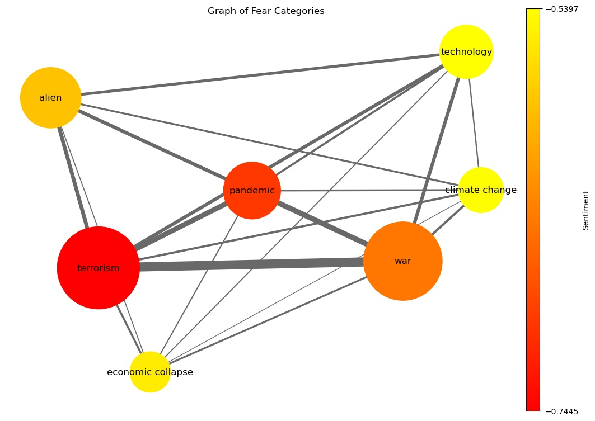

{: style="text-align: justify;"}
Here, at WorkingTeam2023™, we are interested in major societal fears. So, what are we *afraid* of ? We are not talking about fear of spiders or fear of heights, we are talking about major societal fears. [The Chapman University](https://www.chapman.edu/wilkinson/research-centers/babbie-center/survey-american-fears.aspx) conducts yearly studies based on surveys in the United States of America, giving us a starting point for an answer. By taking a look at the results of the surveys from 2018 to 2023, we have chosen to consider 7 majors global fears, which are the following:
*   War
*   Climate Change
*   Terrorism
*   Pandemics
*   Economical Collapse
*   Technological Advancement
*   Aliens

{: style="text-align: justify;"}
Now that we chose what fears we want to dig into, how are these fears depicted in movies? How do they evolve chronologically? Are fears covered in movies related to historical, political or cultural events? What is the geographical distribution of these fears? What patterns emerge in the portrayal of fears, are there recurring combinations of fears depicted on screen? Do movies addressing societal fears tend to have a higher IMDb rating compared to those exploring other themes? And finally, what evolution of the society can we depict from all the previous result?

In brief, **how are major societal fears depicted in the movie industry ?**

## The datasets

{: style="text-align: justify;"}
We will be using the [Movie Summary Corpus](https://www.cs.cmu.edu/~ark/personas/). This dataset contains more than 42'000 movie plot summaries as well as general information about the movie such as the release date or the production country. We added to that the IMDb dataset, which contains information about film's average rating and the number of votes.

## Ready, set... analyse!

{: style="text-align: justify;"}
Hold on! Let's first take a look at our data, and start by seeing how many films have been produced through the years.

<iframe src="movie_release_years.html" width="750px" height="400px" frameborder="0" position="relative">Genre plot</iframe>

{: style="text-align: justify;"}
We clearly see the trend here: the movie industry has grown largely during the recent years, more specifically at the start of the 90s. What about country movie production? Which country is the biggest movie producer?

<iframe src="top_10_countries.html" width="750px" height="400px" frameborder="0" position="relative">Genre plot</iframe>

{: style="text-align: justify;"}
No surprise here, the USA is by far the most productive country followed by India and the United Kingdom, almost tied for second place. The USA are responsible for more than 39% percent of the movies produced! We need to keep in mind that the analysis we will be doing will be biased towards american movies.

## Let's get down to business

{: style="text-align: justify;"}
Let's start by analysing which are the recurrent topics in our dataset. By using topic detection algorithms on the plot summaries, we can extract major subjects from the movie plots. To get better results, we performed several cleaning steps on the plot summaries. Looking for 8 topics yields the best results:

<iframe src="lda.html" width="750px" height="860px" frameborder="0" position="relative">Genre plot</iframe>

{: style="text-align: justify;"}
By setting the relevance metric λ to 0.5, we can interpret the topics' theme as:

1. Drama and/or Relationships
2. Horror
3. Detective and/or Crime
4. War
5. Musical
6. Western
7. Supernatural
8. Undetermined, related to animals or creatures

{: style="text-align: justify;"}
War appears clearly in the most reccurent topics. The word 'war' is also one of the most salient terms, all topics combined. As we discussed in the introduction, we chose war as one of the major societal fear of interest. Thus, movies do indeed discuss societal fears and war seems like the most present societal fear depicted in movies. We will therefore look deeper into the war theme.

{: style="text-align: justify;"}

## War, war never changes...

{: style="text-align: justify;"}

...or does it ? Let's do a topic detection on the plot summaries of movies which can be classified as war movies, by having the 'war' term appearing in the genre list. Looking for 4 topics yields the best results:

<iframe src="lda_genre_war.html" width="750px" height="860px" frameborder="0">Genre plot</iframe>

{: style="text-align: justify;"}
Here, again by setting λ to 0.5 we can distingish 4 topics:

{: style="text-align: justify;"}
* The first one represent the pacific theather of the second World War. We can tell by terms such as '*japanese*', being the most frequent term within the topic, '*american*', '*hitler*' or '*boat*'. 
* The second topic represent mostly the Vietnam War, with terms such as '*vietnam*' or '*vietnamese*'. 
* The third topic seems to englobe war in general, with mostly generic war terms. 
* The forth topic represents the european theater of the second World War. This is clearly seen with terms such as '*jew*', '*jewish*' or '*nazi*'. 

{: style="text-align: justify;"}
We can see that the second World War is the most represented war in movies, with 2 topics out of 4. This is not surprising, as the second World War can be considered the most important war in the history of mankind. As war is one of the main societal fear depicted in movies, we'll take a more specific look on war as a societal fear in movies later on.

{: style="text-align: justify;"}

## Make movies, not war

{: style="text-align: justify;"}
Alright, alright, we get it, war is a very present theme. Let's talk about something happier; let's take a look at the rest of the movies which are not considered as war movies. Again, we apply a topic detection algorithm on the plot summaries. Looking for 4 topics yields the best results:

<iframe src="lda_genre_not_war.html" width="750px" height="860px" frameborder="0">Genre plot</iframe>

{: style="text-align: justify;"}
Again by setting λ to 0.5 we can distingish 4 topics:

{: style="text-align: justify;"}
* Family
* Action and/or War
* Crime 
* Family and/or Science-fiction

It is hard to point out other topics about societal fears. It seems that we need to look for the fears we want to analyze in the plot summaries. Thankfully, the wonderful world of Natural Language Processing is here to help us! Let's build some lexicons!

## \*Insert funny phrase about lexicons here\*

{: style="text-align: justify;"}
Okay, let's get specific then. Since we already know which themes we want to explore in the plot summaries, we'll create an adapted and representative lexicon for each of them. We will then use these lexicons to extract the frequency of each theme in the plot summaries. Here are some examples of the lexicons we created:

*   War : '*mercenary*', '*bloodshed*', '*warfare*'
*   Climate Change :'*volcanoes*', '*contamined*', '*environemental*'
*   Terrorism : '*bombings*', '*government*', '*kidnapping*'
*   Pandemics : '*pandemic*', '*catastophe*', '*immune*'
*   Economical Collapse : '*economy*', '*loans*', '*recession*'
*   Technological Advancement : '*robotics*', '*data*', '*science*' (yes, those last two are very scary indeed!)
*   Aliens : '*martian*', '*universe*', '*ufo*'

{: style="text-align: justify;"}
This way, each movie gets assigned with a frequency metric which measures the proximity of that movie to each one of the themes. #TODO EXPLAIN FREQUENCY Let's see how those frequencies vary throughout the decenies:

<iframe src="evol_freq.html" width="750px" height="500px" frameborder="0"></iframe>

{: style="text-align: justify;"}
We see some interesting trend with 'war' and 'terrorism' following each other closely, and taking the lead in term of lexicon frequency in the recent years. 

## jsp
{: style="text-align: justify;"}
By running sentiment analysis on our data, we found the compound sentiment of our fear categories:

{: style="text-align: justify;"}
This graph should be interpreted the following way:
* The size of the nodes is proportional to the mean frequency of the category
* The distance between the nodes is proportional to the similarity between the lexicons
* The size of the links connecting the nodes is proportional to the lexicon values for movies that have non-zeros lexicon values for both categories
* The color of the node represents the mean sentiment for this category

{: style="text-align: justify;"}
One really interesting finding appears: 'war' and 'terrorism' are far from each other, which means that their lexicons are pretty different from one another, but at the same time we see a strong link between them, meaning they share a lot of movies. This resonates with the trend we've seen just before, with them following approximatively the same trends.

{: style="text-align: justify;"}
Also interesting to note is the proximity of 'war' and 'climate change', and the proximity of 'terrorism' and 'economical collapse', which means their lexicon are quite similar.

{: style="text-align: justify;"}
We finally see that those categories all have a strong negative compound sentiment, which implies fear! How thrilling!

## I can show you the woooorld...

...wait, wrong movie. Sorry. But we can actually show the world ! Let's see jwehf

<iframe src="world_map_all.html" width="900px" height="500px" frameborder="0></iframe>

## Case study: War movies

{: style="text-align: justify;"}
As seen in our first topic detection, war seems to be the most represented societal fear in movies. Let's take a closer look at it. For this category, we can take a look at both the lexicon of war we've created earlier, and war-related genres. This is only possible for the war theme, since it's the only fear category which has genres associated with it.

### Analysis on the war lexicon: from Hollywood to Bollywood

{: style="text-align: justify;"}
In the introduction, we pointed out that the USA and India are the two most productive countries in the movie industry. Let's see how the frequency of the war theme varies in the movies produced by these two countries, by starting with the USA :

<iframe src="usa_war.html" width="750px" height="500px" frameborder="0"></iframe>

{: style="text-align: justify;"}
We observe quite directly that the frequency of the war lexicons is related to major wars in which the USA was involved. For both the first and second World War, peaks in frequency are observable. One should take into account that the peaks are shifted towards the left since we calculate the mean frequency for 5-year periods and we took the lower bound. We can also observe that the frequency drops at the end of each major war. Concerning the Vietnam war, the peak is less present than for the other wars. However, the frequency declines more gently during this period.

{: style="text-align: justify;"}
These findings suggest that a ongoing war may impact the content and number of war-related movies that are being produced. This is not surprising, since the movie industry is a reflection of the society. We also see that the end of a war is followed by a decline in the frequency of the war lexicon. This could be explained by the fact that the public is not interested in war themed movies anymore and directors have less interest in producing them. It is also interesting to see the smoother decline of the frequency during the Vietnam War, which could be explained by the long duration of this war.
Finally, we can also observe that the frequency of the war lexicon is not null during periods of peace. This could be explained by the fact that the war theme is not only related to the war itself, but also to the consequences of war.

{: style="text-align: justify;"}
Let's now take a look at the frequency of the war lexicon in the movies produced by India:

<iframe src="india_war.html" width="750px" height="500px" frameborder="0"></iframe>

{: style="text-align: justify;"}
It seems that the main wars in which India was directly involved in had less impact on the frequency of the war lexicon than for the USA. We can still see that the major increase of the frequency of the war lexicon happens after World War 2, which might be explained by the fact that India was a British colony during this period, and that the war had a major impact on the country. One explanation for the lower frequency of the war lexicon could be that the major movie producer for India, Bollywood, is more focused on the production of musicals and comedies.

### Analysis on war-related genres

{: style="text-align: justify;"}
Let's continue the analysis based on war-related genres. To do so, we've selected movies that have an assigned genre which contains the term 'war'. 

#### Sentiment analysis

{: style="text-align: justify;"}
Okay, war is bad, we've said it before. But is it really ? Let's take a look at the compound sentiment of the movie plots that have a war-related genre, compared to all other movie plots:

<iframe src="compound_sentiment.html" width="750px" height="500px" frameborder="0"></iframe>

{: style="text-align: justify;"}
Well... it *is* really bad. We can first point out that, generaly, movies tend to have a more negative compound sentiment to them. However, we can cleary see that war-related movies perfom worse than other movies when it comes to happy stuff. Not only do they have less positive sentiment in general, they also have more movies that are extremely negative. Fair enough, war is not a happy subject. Bummer.

#### Ratings

{: style="text-align: justify;"}
So, we've seen war is not a postive subject. But is it a good subject ? Let's take a look at the ratings of war-related movies, compared to all movies :

<iframe src="boxplot_average_rating.html" width="560px" height="390px" frameborder="0" scrolling="no" position='relative'></iframe>

{: style="text-align: justify;"}
We see that on average, war-related movies are better rated than the average movie. Is that result statistically significant ? Doing a paired t-test on our data yields a p-value smaller than 0.05, meaning that under the 95% confidence interval, we can reject the null hypothesis that the average rating of war-related movies is equal to the average rating of all movies. This means that war-related movies are indeed better rated than the average movie.

## Conclusion

asd

###### Sources for the images used in the banner

*   [War](https://www.dvidshub.net/image/1934815/digital-art-still-within-me-second-place)
*   [Climate Change](https://fineartamerica.com/featured/climate-change-robert-orinski.html)
*   [Terrorism](https://www.deviantart.com/tecnificent/art/The-Terrorist-184405045)
*   [Pandemics](https://www.nature.com/articles/d41591-021-00009-5), art by Jessica Johnson
*   [Economical Collapse](https://www.futura-sciences.com/sciences/questions-reponses/epoque-contemporaine-sont-consequences-krach-1929-5526/)
*   [Technological Advancement](https://ticktocktech.com/blog/2021/08/18/how-technology-is-changing-the-art-world/)
*   [Aliens](https://fineartamerica.com/featured/alien-invasion-03-matthias-hauser.html)
*   [War begins](https://www.pinterest.fr/pin/11822017755734478/)
*   [War ends](https://www.pinterest.fr/pin/563794447116801159/)