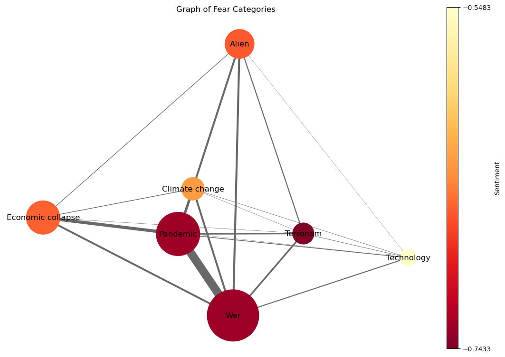

{: style="text-align: justify;"}
Here, at WorkingTeam2023™, we want to know what are societal fears. So, what are we *afraid* of ? We are talking about societal fears, like the fear of a global pandemic or the fear of a nuclear war, not the fear of spiders or the fear of heights. [The Chapman University](https://www.chapman.edu/wilkinson/research-centers/babbie-center/survey-american-fears.aspx) conducts yearly studies based on surveys in the United States of America, giving us a starting point for an answer. By taking a look at the results of the surveys from 2018 to 2023, we have chosen to consider 7 majors global fears, which are the following :
*   War
*   Climate Change
*   Terrorism
*   Pandemics
*   Economical Collapse
*   Technological Advancement
*   Aliens

{: style="text-align: justify;"}
We also want to know whereas these subjects appears in the cinema industry, and whether the movies treating them know some kind of success, aswell as point geographical and temporal trends.

## The datasets

{: style="text-align: justify;"}
We will be using the [Movie Summary Corpus](https://www.cs.cmu.edu/~ark/personas/), which is a dataset containing more than 42'000 movie plot summaries, aswell as some other corresponding metadata. Added to that is the IMDb, which contains information about film's box office.

## Ready, set... analyse !

{: style="text-align: justify;"}
Hold on ! Let's first take a look at our data, and start by first seeing how many films have been produced through the years 

<iframe src="movie_release_years.html" width="750px" height="400px" frameborder="0" position="relative">Genre plot</iframe>

{: style="text-align: justify;"}
We clearly see the trend here : The movie industry has grown largely during the recent years, more specificaly at the start of the 90s ! What about country movie production ? Which country is the more productive ?

<iframe src="top_10_countries.html" width="750px" height="400px" frameborder="0" position="relative">Genre plot</iframe>

{: style="text-align: justify;"}
No surprises here, the United States of America is by far the most productive country, followed by India with Bollywood and the United Kingdom, almost tied for second place. The USA are responsible for more than 39% percent of the movie produced ! We need to keep in mind that the analysis we will be doing will be biased towards the USA.

## Let's get down to business

{: style="text-align: justify;"}
Let's start by analysing which are the recurrent topic in movies. By using topic detection algorithms on the plot summaries, we can extract major subjects from the movie plots. Looking for 8 topics yields the best results :

<iframe src="lda.html" width="750px" height="860px" frameborder="0" position="relative">Genre plot</iframe>

{: style="text-align: justify;"}
By setting λ to 0.5, we can interpret the following topics :

1. Drama and/or Relationships
2. Horror
3. Detective and/or Crime
4. War
5. Musical
6. Western
7. Supernatural
8. Undetermined, related to animals or creatures

{: style="text-align: justify;"}
War appears naturaly in the most reccurent topics. It is also on of the most salient terms, all topic cofounded. This indicate an interest for war in itself, but also for the consequences of war, such as the loss of loved ones, the destruction of the environment, etc. This implies that war is one of the most important societal fears.

## War, war never changes...

{: style="text-align: justify;"}
...or does it ? Let's do a topic detection on the plot summaries of movies which can be classified as war movies, by having the 'war' term appearing in the genre list. Looking for 4 topics yields the best results :

<iframe src="lda_genre_war.html" width="750px" height="860px" frameborder="0" position="relative">Genre plot</iframe>

{: style="text-align: justify;"}
Here, again by setting λ to 0.5 we can distingish 4 topics :

{: style="text-align: justify;"}
* The first one represent the pacific theather of the second World War. We can tell by terms such as '*japanese*', being the most frequent term within the topic, '*american*', '*hitler*' or '*boat*'. 
* The second topic represent mostly the Vietnam War, with terms such as '*vietnam*' or '*vietnamese*'. 
* The third topic seems to englobe war in general, with mostly generic war terms. 
* The forth topic represents the european theater of the second World War. This is clearly seen with terms such as '*jew*', '*jewish*' or '*nazi*'. 

{: style="text-align: justify;"}
We can see that the second World War is the most represented war in movies, with 2 topics out of 4. This is not surprising, as the second World War can be considered the most important war in the history of mankind.

## Make movies, not war

{: style="text-align: justify;"}
Alright, alright, we get it, war is not good. Let's talk about something happier; let's take a look at the rest of the movies which are not considered as war movies. Again, we apply a topic detection algorithm on the plot summaries. Looking for 4 topics yields the best results :

<iframe src="lda_genre_not_war.html" width="750px" height="860px" frameborder="0" position="relative">Genre plot</iframe>

## *insert funny phrase about lexicons*

{: style="text-align: justify;"}
Okay, let's get specific then. Since we already know which themes we want to explore in the plot summaries, we'll create adapted and representative lexicons for each of them. We will then use these lexicons to extract the frequency of each theme in the plot summaries. Here are some examples of the lexicons we created :

{: style="text-align: justify;"}
*   War : '*war*', '*conflict*', '*battle*', '*combat*'
*   Climate Change :'*global_warming*', '*greenhouse_gas*', '*carbon_footprint*', '*renewable_energy*'
*   Terrorism : '*terrorism*', '*extremism*', '*radicalization*', '*terrorist_attack*'
*   Pandemics : '*pandemic*', '*epidemic*', '*outbreak*', '*virus*'
*   Economical Collapse : '*economic_crisis*', '*financial_collapse*', '*recession*', '*depression*'
*   Technological Advancement : '*robotics*', '*artificial_intelligence*', '*automation'*, '*data_science*' (yes, very scary indeed!)
*   Aliens : '*extraterrestrial*', '*alien*', '*UFO*', '*alien_abduction*'

<iframe src="test_map2.html" width="600px" height="500px" frameborder="0" position="relative"></iframe>

## Quick statistical detour : what indicates that a movie is good ?

It is safe to say that a good movie is more likely to perform well at the box office; however, not all good movies perform well saleswise. Is there a correlation between movies revenues and the average rating given to them on [IMDb](https://www.imdb.com) ?
Let's take a very quick detour by the wonderful world of statistics !

Using the Pearson correlation, we 

